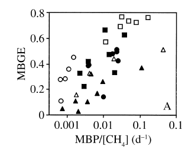

## Methane oxidation

Methanotrophic bacteria utilize methane (CH~4~) as both an energy and carbon source through a process known as methanotrophy.  The proportion of carbon that is incorporated into biomass, as opposed to being oxidized to CO~2~, is known as the methanotrophic bacterial growth efficiency (MBGE).  In the theoretical case where MBGE is 0, the stoichiometry of methanotrophy is:

CH~4~ + 2O~2~ -> CO~2~ + 2H~2~O

and CH~4~ is converted to CO~2~ in a 1:1 molar ratio.  On a mass basis, 16 units of CH~4~ are converted to 44 units of CO~2~.  MBGE has been shown to vary from 0.05 to 0.8 across lakes and seasons (Bastviken et al. 2003).  Bastviken et al (2003) present 38 MBGE measurements made at different depths and seasons in 3 lakes.  The data are reported as a range (0.05 - 0.8) and presented in a figure: 
  
.  
  
The x-axis of the figure is the ratio of the methanotrophic bacterial production and methane concentration.  x-axis values are not relevant to this discussion.  The MBGE values are mapped to the y-axis and appear to have a fairly uniform distribution which could be modeled as `runif(n, 0.05, 0.8)`.

Methane produced during periods of ice cover is isolated from the atmosphere and is trapped under ice. 

  
When the ice cover breaks up in the spring, a process known as ice out, accumulated CH~4~ can vent to the atmosphere.  However, ice out also allows for oxygen to penetrate into the water column which can stimulate methanotrophy.  The result is that some fraction of the accumulated CH~4~ is converted to biomass + CO~2~ and the remaining fraction is released to the atmosphere as CH~4~.  The mass of accumulated CH~4~ subject to methanotrophy during ice out is typically estimated via mass balance:
  
mass of CH~4~ lost to methanotrophy = mass of CH~4~ under ice - mass of CH~4~ vented to atmosphere at ice out

where "mass of CH~4~ under ice" and "mass of CH~4~ vented to atmosphere at ice out" are measured directly.  In this mass balance approach, the term "mass of CH~4~ lost to methanotrophy" includes all CH~4~ subject to methanotrophy, regardless of whether the CH~4~ is converted to biomass or CO~2~.  Michmerhuizen et al (1996) reported that 1.1 - 7.4% of accumulated CH~4~ was subject to methanotrophy during ice out in two boreal lakes in northern Minnesotta.  Kankaala et al. (2006) reported that up to 50% of accumulated CH~4~ was subject to methanotrophy during ice out in a boreal lake in Sweden.  While several other studies report ice out CH~4~ emissions (Phelps et al. 1998, Sepulveda-Jauregui et al. 2015, Wik et al. 2016, Karlsson et al. 2013), I was unable to locate additional studies that report the fraction of accumulated CH~4~ subject to methanotrophy during ice out.  Given the relative paucity of data, perhaps we can model the proportion as `runif(n, 0.01, 0.6)`, reflecting a slightly broader range of values than reported in the literature.

Our simulation of winter CH~4~ and CO~2~ emissions from lakes can therefore account for the conversion of CH~4~ to CO~2~ via three steps:

##### step 1: discount winter CH~4~ emissions for the mass of CH~4~ subject to methanotrophy during ice out:
  
mass of CH~4~ subject to methanotrophy during ice out = [winter CH~4~ emission rates * days of ice cover * surface area] * runif(n=1, min = 0.01, max = 0.06)
\  
\   
\   

##### step 2: calculate the mass of CH~4~ converted to CO~2~ during ice out:
  
mass of CH~4~ converted to CO~2~ during ice out = [mass of CH~4~ subject to methanotrophy during ice out] * [1- runif(n=1, min = 0.05, max = 0.8)]
\  
\   
\  

##### step 3: add the CO~2~ produced via methanotrophy to the CO~2~ production predicted via the DelSontro et al. CO~2~ model:
  
mass of CO~2~ produced via methanotrophy during ice out = mass of CH~4~ converted to CO~2~ during ice out * (44/16)
  
where `44/16` accounts for the difference in mass between CH~4~ and CO~2~.

 

